```{r setup, include=FALSE}
knitr::opts_chunk$set(
  tidy = TRUE,
  tidy.opts = list(width.cutoff = 200),
  message = FALSE,
  warning = FALSE,
  fig.width = 10,
  time_it = TRUE,
  error = TRUE
)
```

The primary objective of MGPfact is to deconstruct complex cellular trajectories into a series of interpretable bifurcation events, each uniquely characterizing a specific biological process, defined and represented by a group of influential genes. This targeted embedding approach endows MGPfact with a significant advantage in capturing subtle variations within biological pathways. Building on this, we have further developed differential gene analysis for various biological branching processes, as well as consensus trajectories that depict the intricate processes of biological development.

In this vignette, we demonstrate how to perform trajectory reconstruction using MGPfact.

* Performed MURP downsampling of the preprocessed scRNA-seq data.
* Decomposable cellular trajectories
* Streamlined trajectory and factorizing gene modules
* Differentially expressed genes.

Prior to running this vignette, please [install MGPfactR and MGPfact.jl](https://github.com/renjun0324/MGPfactR).

```{r, warning=F, message=F,eval=FALSE}
library(MGPfactR)
# Alternatively, you can set your julia_home directory.
julia_home = gsub("/julia$", "", system("which julia", intern = TRUE))
```

## Create MGPfact Object    
In principle, MGPfact accepts gene expression matrices in all forms. To align with the majority of existing analysis workflows, we utilize data that has been normalized for presentation. The test dataset originates from [Saelens et al.](https://www.nature.com/articles/s41587-019-0071-9), and can be downloaded via a website [link](https://zenodo.org/records/1443566).
`
```{r eval=FALSE, message=FALSE, warning=FALSE, include=FALSE}

# load test datasets
data(fibroblast_reprogramming_treutlein)
data = fibroblast_reprogramming_treutlein
counts = data$counts
cell_info = data$cell_info
rownames(cell_info) = cell_info$cell_id

# normalize data
expression = LogNormalize(t(counts))

```

The parameter `dir` indicates the path where the analysis results will be stored. `CreateMGPfactObject` will construct a folder under dir; if not set, it will default to the current directory.

```{r, warning=F, echo=FALSE, message=F,eval=FALSE, include=FALSE}
# create object
ct <- CreateMGPfactObject(data_matrix = t(expression),
                          MetaData = cell_info,  
                          datasetTitle = "test",
                          dir = NULL)

# dimensionality reduction
ct <- RUNPCA(ct, center = T, scale = T) ## 用scaled-data，center不需要TRUE
ct <- RUNUMAP(ct, npc = 1:30)
```

## MURP downsampling

We can control the amount of downsampling using the parameter `max_murp`. By default, we believe that 50 to 150 MURP subsets are sufficient to demonstrate the variations in differentiation states.

```{r, warning=F, message=F, eval=FALSE}
ct = MURPDownsampling(ct, plot = T, max_murp = 50)
```

<div align="center">
  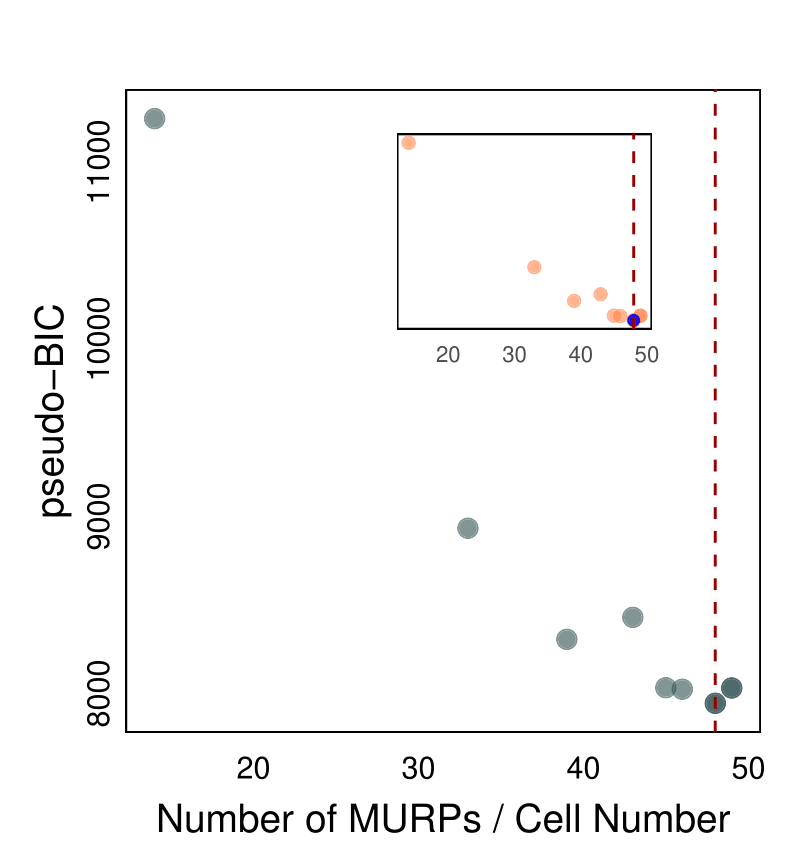{width=30%}
</div>

After downsampling, each MURP represents a MURP subset, and we can map the labels of the cells onto the downsampled MURP subsets.

```{r, warning=F, message=F,eval=FALSE}
ct = GetMURPMapLabel(ct, labels = c("time_point","experiment"))
PlotLabelMerge(ct, labels = "time_point", width = 6)
```

<div align="center">
  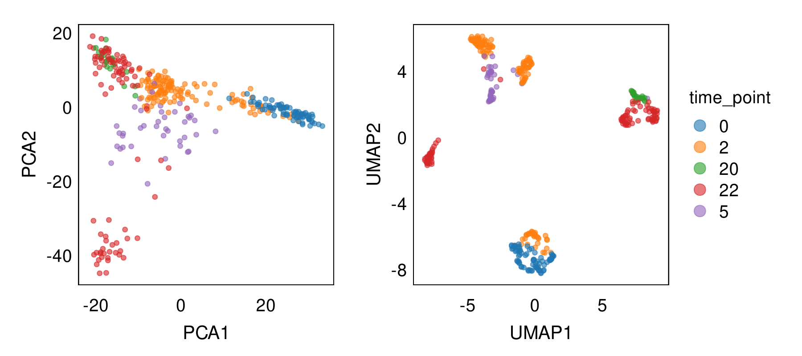{width=60%}
  
  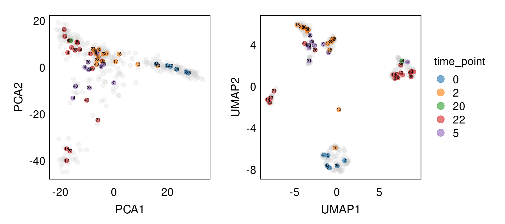{width=60%}
</div>

## Initialize parameters

```{r, warning=F, message=F,eval=FALSE}

# Store the PC results of MURP locally
SaveMURPDatToJulia(ct, murp_pc_number = 10)
```

MGPfact allows for the selection of initial nodes, and we offer two methods: 

* Provide specific cell names and determine their corresponding MURP through the names.
* Select the starting point through the index labels of MURP in the figure above, and multiple starting points can be set. 
  
If there is no starting point, you can set `start_murp` to 999, which is an index that does not exist in MURP.

```{r, warning=F, message=F,eval=FALSE}

# 1) Find start murp using cells
# start_cell = c("1_iN2_C82")
# sapply(start_cell, function(st){
#   ind = which(names(ct@MURP$Recommended_K_cl$cluster)==st)
#   x = as.vector(ct@MURP$Recommended_K_cl$cluster[ind])
#   return(x)
# }) -> start_murp

# 2) choose start_murp using murp label
start_murp = c(24, 2, 35)

# Set settings
# The parameter "chains_number" represents the number of Markov chains, and it is generally set to no more than 10.
# The parameter "pse_optim_iterations" refers to the number of sampling iterations. Generally speaking, the greater the number of sampling iterations, the more stable the convergence of the results, but this will be accompanied by increased time consumption.
ct = SetSettings(ct, 
                 murp_pc_number = 3, 
                 trajectory_number = 3, 
                 pse_optim_iterations = 200, 
                 start_murp = start_murp,
                 chains_number = 5)
save(ct, file = "ct.rda")
writeSettings(ct)
```

## Decomposable cellular trajectories.

##### 1) Estimate model parameters through MCMC sampling
```{r, warning=F, message=F,eval=FALSE}
# 1. pse_optim
ct = RunningmodMGPpseudoT(ct, julia_home = julia_home, cores = 1)
```

##### 2) Organize the results of parameter optimization.
```{r, warning=F, message=F,eval=FALSE}
ct <- GetIterCor(ct, iteration_list = list(c(1, getParams(ct,"pse_optim_iterations"))))
ct <- GetPredT(object = ct, chains = 1:getParams(ct,"chains_number"))
ct <- GetPseSdf(ct)

# This function can be used to obtain trajectory branch labels and pseudo time information.
sdf <- GetMURPInfo(ct)
```

##### 3) Construct trajectory
```{r, warning=F, message=F,eval=FALSE}
ct <- GetBinTree(object = ct)
ct <- GetTbTree(object = ct)
ct <- GetTbTreeAllpoint(object = ct, save = T, labels = getParams(ct,"label"))
```

##### 4) Trajectory visualization
```{r, warning=F, message=F,eval=FALSE}
PlotBinBif(ct, plot_label = TRUE)
```

<div align="center">
  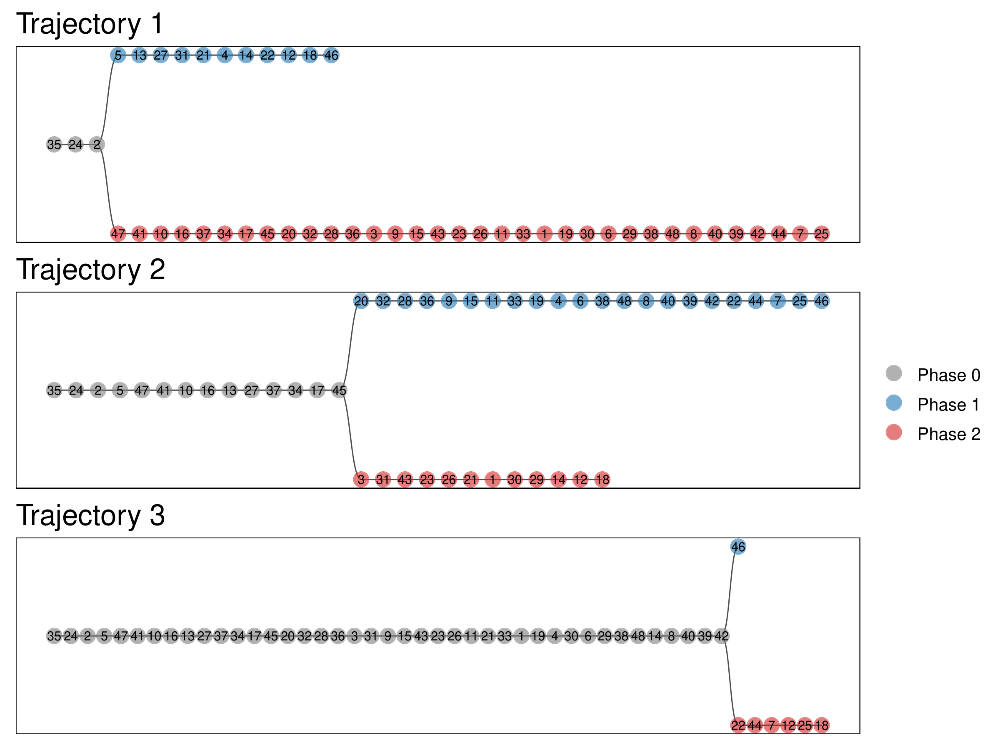{width=60%}
</div>

```{r, warning=F, message=F,eval=FALSE}
PlotPieBinLabel(ct, labels = "time_point")
```

<div align="center">
  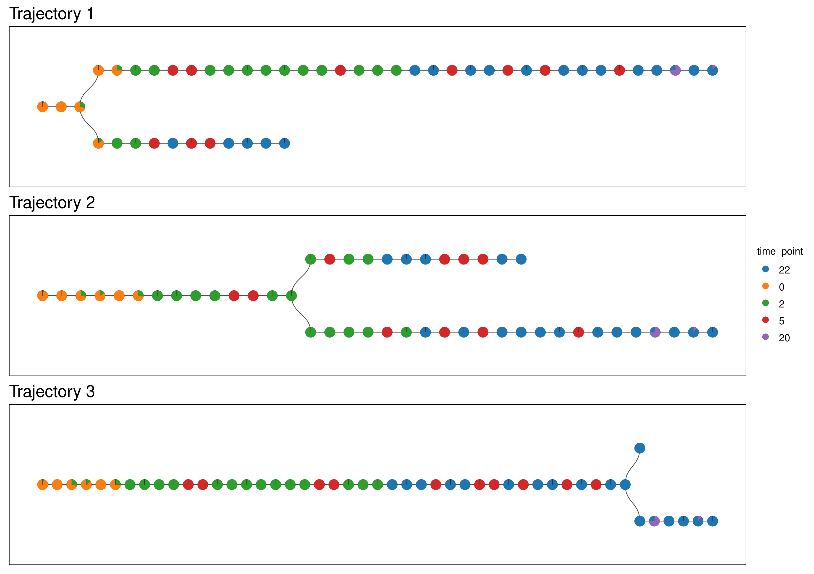{width=60%}
</div>

```{r, warning=F, message=F,eval=FALSE}
PlotPieTbLabel(ct, labels = "time_point")
```

<div align="center">
  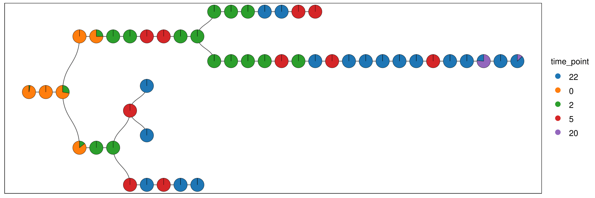{width=60%}
</div>

```{r, warning=F, message=F,eval=FALSE}
PlotPieConsensusMainLabel(ct, labels = "time_point")
```

<div align="center">
  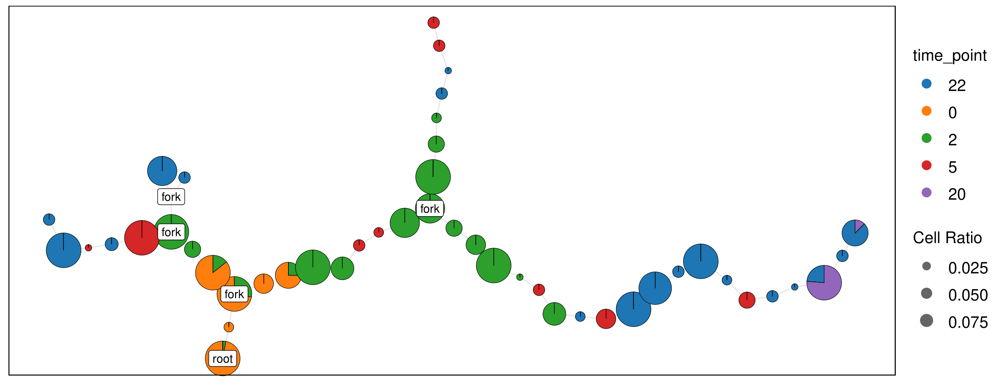{width=60%}
</div>

```{r, warning=F, message=F,eval=FALSE}
PlotPieConsensusAllLabel(ct, labels = "time_point", cell_size = 5, cell_alpha = 0.2)
```

<div align="center">
  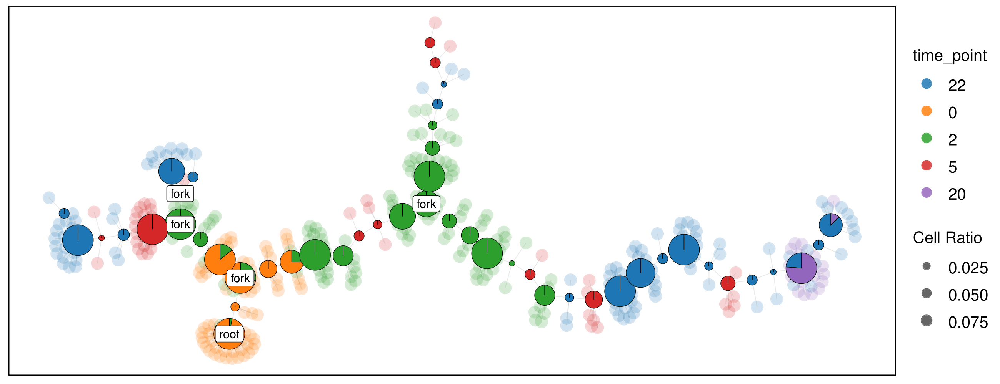{width=60%}
</div>

## Streamlined trajectory and factorizing gene modules

##### 1) Obtain the covariance matrix corresponding to each bifurcation event.

```{r, warning=F, message=F,eval=FALSE}
ct = GetSigmaFromJulia(object = ct, load = F, julia_home = julia_home)
```

##### 2) Streamlined trajectory

```{r, warning=F, message=F,eval=FALSE}
ct = RunningmodMGPtrack(object = ct, iter = 800, cores = 10)
ct = GetTrackSdfFromOptim(object = ct)
```

##### 3) visualization

```{r, warning=F, message=F,eval=FALSE}
TrajPlot(ct, save = TRUE, legend_title = "Phase",rug=F)
TrajPlot(ct, col = "time_point", save = TRUE, legend_title = "time_point")
```

<div align="center">

  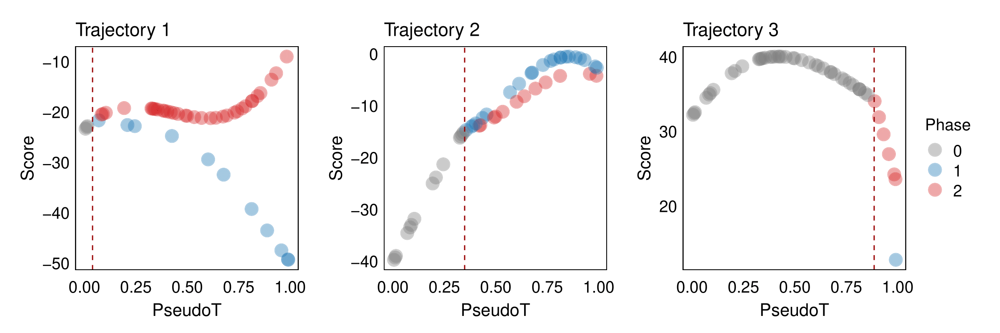{width=70%}

  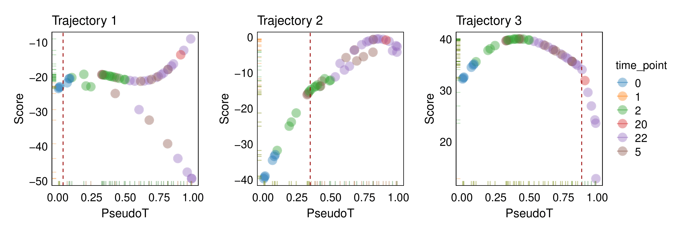{width=70%}

</div>

##### 4) Factorizing gene modules

Extract the high-weight gene sets for each trajectory, which are the decisive embedding features we referred to for each trajectory.

```{r, warning=F, message=F,eval=FALSE}

# filter highly weight genes
ct = WeightGeneFilter(ct, method = "weight_cut", weight_cut = 0.03)

# get gene weight
gene_weight = GetGeneWeight(ct) 

# extract gene module for each trajectory
filter_g = WriteWeightGene(ct, "weight_cut")
```

```{r, warning=F, message=F,eval=TRUE}
x = read.csv("gene_weight_weight_cut_6923_6923.csv")
head(x)
```

Differences of top 1 weight gene of each trajectory at different trajectory phase.
```{r, warning=F, message=F,eval=FALSE}
GeneBoxPhase(object = ct,gene = c("Lgals1","S100a6","Cox6a1"), aspect = "cell")  
```

<div align="center">
  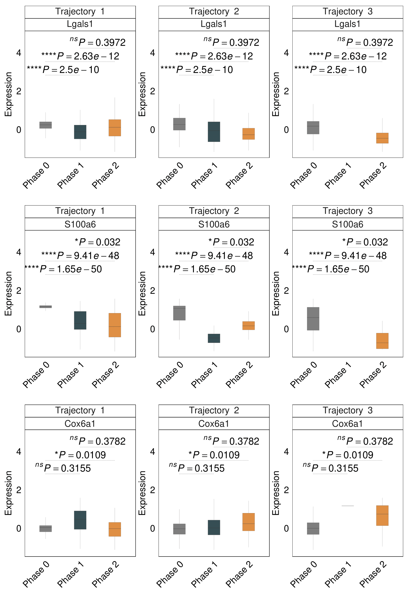{width=40%}
</div>

Additionally, we employed Gaussian process regression to design the estimation of the branching expression trend for any given gene across different trajectories, which we then visualized. The smooth curves represent the fitted values of expression, while the points indicate the average expression of the gene within the MURP subset.

```{r, warning=F, message=F,eval=FALSE}
ct = GetMURPGene(ct)
ct = GetCurveSdf(ct)
ct = GetGeneCurve(object = ct, genes = c("Lgals1","S100a6","Cox6a1"), n.samples = 100) 
```
     
```{r, warning=F, message=F,eval=FALSE}
GeneCurvePlot(object = ct, gene = c("Lgals1","S100a6","Cox6a1"), col = "time_point")
```

<div align="center">
  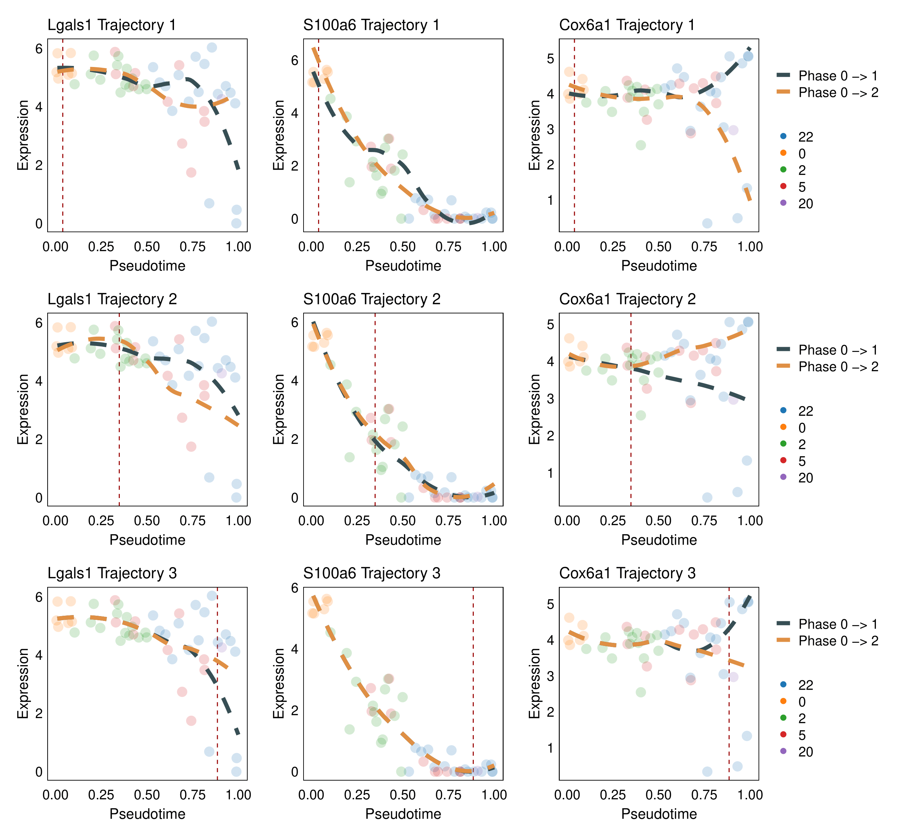{width=60%}
</div>

## Differentially expressed genes
We also offer various methods for calculating differential genes, such as mean differences between branches (`ComputeMeanDiff`), statistical models for the interaction effects of time and branches (`ComputeInteractionEffectGene`), and significant correlations with time (`ComputeCorGeneT`).
```{r, warning=F, message=F,eval=FALSE}

ct = ComputeInteractionEffectGene(ct, save_mod = FALSE, adjust_method = "fdr")
ct@BeautGene = ComputeSigGene(ct@BeautGene, "lm", "fdr", 0.05)

# write significant genes to txt
WriteGene2TXT(ct@BeautGene, "lm", "bonferroni", "c", 0.05)

```

```{r, warning=F, message=F,eval=FALSE}
save(ct, file = "ct.rda")
writeSettings(ct)
```
<details>
  <summary>**Session Info**</summary>
```{r, eval = TRUE}
sessionInfo()
```
</details>
